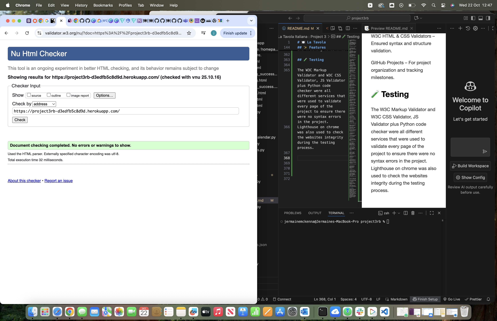
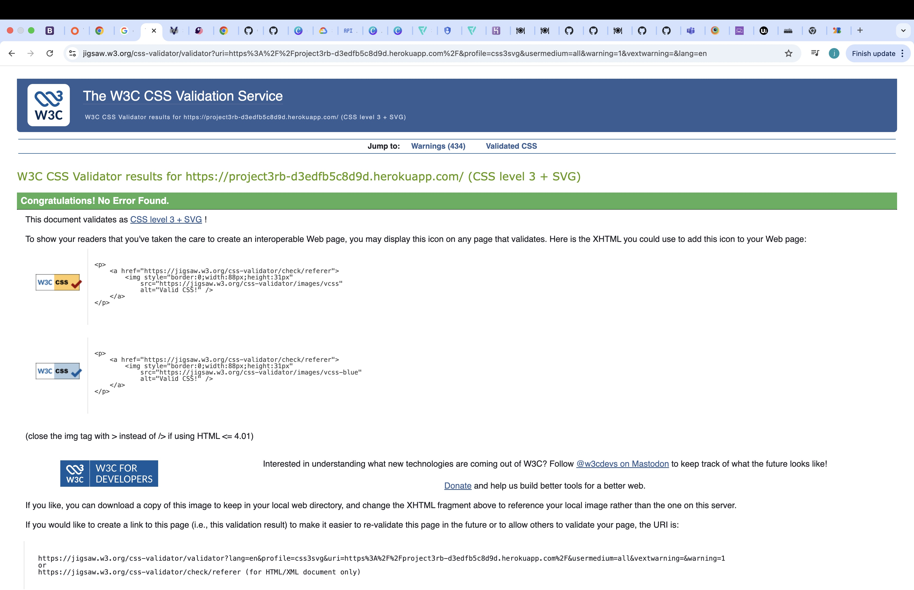
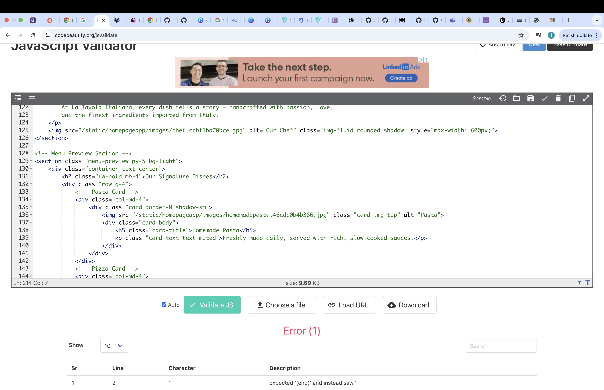

# 🍽️ La Tavola Italiana : Project 3
---
## 📖 Project Overview

The Restaurant Booking System Project is a full-stack web application built using HTML, CSS, JavaScript, Python, and Django, designed to provide users with a smooth and responsive experience when reserving a table at a restaurant.

The website allows visitors to browse the restaurant’s menu, make online bookings, and send contact messages — all within a clean and mobile-friendly interface.

The project demonstrates the integration of a relational database, with PostgreSQL handling data for bookings, contact messages, and tables.

Users can submit reservation details via a secure online form, which is processed and stored in the database for the site owner to manage.

This application was developed as part of my Code Institute Level 5 Diploma in Web Application Development, showcasing skills in full-stack development, database management, and deployment using Heroku.

The system aligns with the course’s mandatory project criteria by providing complete CRUD functionality, structured front-end design, and integration with external APIs (Google Calendar).

The site aims to simplify restaurant reservations by offering a digital alternative to traditional booking methods, while maintaining an elegant and authentic Italian-inspired design theme throughout the interface.

[View the live project here.](https://project3rb-d3edfb5c8d9d.herokuapp.com/)

---
## 🗣️ User Experience (UX)

<u>User Stories</u>
  <u>First Time Visitor Goals</u>

- As a first-time visitor, I want to immediately understand what the website is about so I can see that it’s for restaurant table bookings.

- As a first-time visitor, I want to browse the menu section to explore what types of dishes and drinks the restaurant offers.

- As a first-time visitor, I want to easily find the booking form to reserve a table without needing to call or email.

- As a first-time visitor, I want to feel confident that my booking details will be securely stored and confirmed.

- As a first-time visitor, I want to send a message or enquiry to the restaurant for special occasions or dietary requests.

- As a first-time visitor, I want the website to load quickly and display correctly on my mobile, tablet, or desktop device.

<u>Returning Visitor Goals</u>

- As a returning visitor, I want to make another booking without having to learn the system again it should feel familiar and simple.

- As a returning visitor, I want to check if the restaurant has added new menu items, specials, or seasonal dishes.

- As a returning visitor, I want to modify or cancel a booking easily if my plans change.

- As a returning visitor, I want to contact the restaurant again with follow-up questions or feedback via the contact form.

- As a returning visitor, I expect consistent branding and performance so that I trust the restaurant’s online service.

<u>Frequent User Goals</u>

- As a frequent user, I want to quickly view available dates and times for booking my favourite table.

- As a frequent user, I want to check for promotions, events, or loyalty offers that might encourage me to visit again.

- As a frequent user, I want to see menu updates or new dishes since my last visit.

- As a frequent user, I want to know that my previous booking and contact history are stored securely and handled professionally.

- As a frequent user, I expect the website to stay fast, modern, and responsive each time I visit, with a consistent design and reliable functionality.
---

###<u>Design</u>

<u>Colour Scheme</u>

The restaurant website uses a warm and authentic Italian-inspired color palette, designed to reflect a welcoming, high-quality dining atmosphere. The combination of colors is elegant yet comforting — echoing the tones of Italian interiors and cuisine.

 ### Colour - Hex Code - Purpose

- Ivory	#fff8f0	Used as the main background color to create warmth and readability

- Deep Green	#2e7d32	Used for headings and highlights to symbolize freshness and nature

- Italian Red	#c62828	Used for buttons and key accents to represent passion and Italian heritage

- Dark Charcoal	#333	Used for standard text for easy readability

- Soft Cream	#fdf6f0	Used in hero and content sections for a subtle & luxurious tone.

These colors work together to create a consistent brand identity that is both modern and inspired by traditional Italian design sensibilities.

---
###<u>Typography</u>

Two fonts were chosen to complement the restaurant’s aesthetic and ensure readability across all devices:

Playfair Display – used for headings to add a classic, elegant feel (serif font inspired by traditional Italian signage).

Poppins – used for body text to maintain clean, modern readability with a friendly tone.

Both fonts are imported via Google Fonts and are supported by standard sans-serif fallbacks.

[Click here for Google Fonts Link](https://fonts.google.com/specimen/Playfair+Display)

This pairing creates a clear hierarchy between headings and body text while keeping the designs visually balanced.

---
###<u>Imagery</u>

Imagery plays a vital role in the restaurants visual experience:

- The hero section features Italian dining or cuisine photography that instantly communicates the atmosphere.

- The menu cards and about section images are styled with round edges and soft shadows to maintain consistency and profressionalism.

- All images were optimized for performance and responsiveness, ensuring fast load times on both desktop and mobile devices.

Overall the projects imagery focuses on food, culture and hospitality, all key emotional triggers for users looking to book at a restaurant.

---
###<u>Layout and Structure</u>

The layout follows a mobile-first responsive design, structured with Bootstrap’s grid system for consistency and scalability.
All sections — such as the hero, about, menu preview, booking form, and contact — adapt fluidly to various screen sizes, ensuring an optimal experience across devices from small smartphones to large monitors.

Key layout features:

- Responsive navigation bar and footer across all pages

- Centered hero content with overlay text for impact

- Grid-based menu layout for clear food item presentation

- Well-structured forms with spacing, validation, and responsive input fields

- Balanced use of white space and color accents to keep the site visually calm and readable

---
###<u>Accessibility</u>

Accessibility best practices were implemented throughout the design.

- All interactive elements (buttons, links, forms) have clear focus states and accessible labels.

- High color contrast between text and backgrounds ensures legibility.

- Semantic HTML tags are used for headings, sections, and navigation elements to improve screen reader compatibility.

- Forms include placeholder text and ARIA labels for usability.
---

## ✨ Features

###<u>Homepage</u>

A welcoming hero section introduces visitors to the restaurant with a clear call-to-action button for making a booking.
Includes a short introductory paragraph about the restaurant’s theme, atmosphere, and dining experience.
The design uses a subtle overlay and animation to create a visually engaging first impression.
Fully responsive layout ensuring an elegant appearance on all screen sizes.

<u>Menu Page</u>

Displays a selection of dishes grouped by category — starters, mains, desserts, and drinks.
Each menu item is shown using Bootstrap cards with smooth hover effects and shadows for a professional finish.
The layout automatically adapts for mobile and tablet devices, showing fewer items per row on smaller screens.
Easy to update dynamically through the Django database or admin panel if new dishes are added.

<u>Booking System</u>

- A fully functional table booking form allows users to select:
Their name, email, phone, date, time, and number of guests.

- Optional special requests for dietary needs or occasions.

- Bookings are stored securely in the database using Django’s ORM.

- A success page confirms that the booking was completed.

- Google Calendar API integration automatically creates an event for each booking, syncing it with the restaurant’s schedule.

- Built-in form validation ensures that no invalid or incomplete bookings can be submitted.

<u>Contact Page</u>

A user-friendly contact form where visitors can send messages or enquiries directly to the restaurant.
Messages are saved in the database and can be viewed in the Django Admin panel.
Confirmation feedback is displayed upon successful submission.
Uses Django’s built-in form validation to ensure correct email formatting and message input.

<u>REST API Endpoints</u>

Two main API endpoints are available via Django REST Framework:

- /api/bookings/ — Displays all booking records (GET), allows creation of new bookings (POST), and editing or deletion (PUT/DELETE).

- /api/contactmessages/ — Displays, creates, edits, or deletes messages submitted through the contact form.

- These APIs support CRUD functionality and are useful for integrating with external systems or mobile applications in the future.

<u>Admin Dashboard</u>

Django’s built-in admin interface provides a simple way to manage:

- Menu items
- Bookings
- Contact messages
- Users and permissions
- Admins can manually add, edit, or delete records, ensuring full control over the site’s data.

<u>Responsiveness</u>

- The entire website is built with a mobile-first approach using Bootstrap 5 and custom CSS media queries.

- Tested across multiple screen sizes and devices to ensure a consistent user experience.

- Elements like navigation, forms, and grids automatically adjust for small, medium, and large viewports.

<u>Security Features</u>

- CSRF protection for all form submissions.

- Secure handling of secret keys and Google API credentials using Heroku environment variables.

- HTTPS enforced via Heroku’s SSL.

- No sensitive credentials are stored in the project repository.

<u>Database</u>

- The project uses PostgreSQL for production (via Heroku) and local PostgreSQL for development.

- The database stores all bookings, contact messages, menu items, and user data.

- Relationships between models (Users, Tables, Bookings, Messages) are well-structured and normalized.

<u>Deployment</u>

- The project is deployed on Heroku with static files served using Whitenoise.

- A custom domain or subdomain can be easily linked.

- Environment variables like DATABASE_URL, DEBUG, and GOOGLE_CREDS are securely managed via Heroku’s config vars.

<u>Navigation & Layout</u>

- A Bootstrap navbar ensures users can easily navigate between pages.

- The navbar automatically collapses into a mobile-friendly toggle menu on smaller devices.

- A consistent footer section provides contact links, social icons, and copyright information.

<u>Future Enhancements</u>

- User authentication for registered customers (login/signup).

- Automatic email confirmations when a booking is created.

- Booking management dashboard for users to view and cancel their reservations.

- Integration of table availability logic to prevent double bookings.

- Additional visual enhancements such as image galleries and reviews section.
---
###<u>🧰 Technologies Used</u>

<u>Languages Used</u>

- HTML5 – for page structure and semantic markup.

- CSS3 – for styling, layout, and responsive design.

- JavaScript (ES6) – for interactive features and Bootstrap’s built-in functionality.

- Python 3 – for server-side logic, database management, and API handling within Django.

###<u>Frameworks, Libraries & Tools</u>

<u>Django 4.2</u>

- The main Python web framework used to build the project.

- Manages URLs, views, models, forms, authentication, and database operations.

- Used for creating REST APIs through the Django REST Framework.

<u>Django REST Framework (DRF)</u>

- Handles the creation of API endpoints for bookings and contact messages.

- Enables full CRUD functionality (Create, Read, Update, Delete).

- Provides robust serialization and validation for API data.

<u>Bootstrap 5</u>

- Used extensively for responsiveness and layout structure.

- Ensures the website adapts perfectly to various screen sizes.

- Provides components such as modals, buttons, navbars, and carousels.

<u>PostgreSQL</u> 

- The relational database used for production on Heroku.

- Stores all booking, contact, and user data.

- Ensures data integrity and scalability for real-world usage.

<u>Google Calendar API</u>

Connects the website’s booking form with a Google Calendar.

Automatically creates an event when a new booking is made.

Uses secure credentials stored in Heroku environment variables.

<u>Whitenoise</u>

- Simplifies static file handling in production.

- Compresses and serves CSS, JS, and image files efficiently.

<u>Gunicorn</u>

- Python WSGI HTTP server used to deploy Django applications on Heroku.

<u>dj-database-url</u>

Allows Django to connect easily to Heroku’s PostgreSQL database via an environment variable.

<u>Widget Tweaks</u>

- Used to customize form styling within Django templates without modifying form classes.

<u>Git</u>

- Used for version control to commit changes and track project development.

<u>GitHub</u>

- Stores the project’s repository and documentation.

<u>Heroku</u>

- Hosting platform for deploying the live Django web application.

- Handles server-side operations and database connections.

<u>Balsamiq Wireframes</u>

- Used during the planning phase to design basic page layouts and UX structure.

<u>Google Fonts</u>

- Imports the custom typography (Playfair Display & Poppins) used throughout the website.

<u>Font Awesome</u>
Provides iconography used in the footer, navbar, and buttons for better UI/UX.

###<u>Additional Tools</u>

VS Code – Primary code editor for development.

Chrome DevTools – Used for live responsiveness and debugging.

W3C HTML & CSS Validators – Ensured syntax and structure validation.

GitHub Projects – For project organization and tracking milestones.

## 🧪 Testing

The W3C Markup Validator and W3C CSS Validator, JS Validator plus Python code checker were all different services that were used to validate every page of the project to ensure there were no syntax errors in the project.
Lighthouse on chrome was also used to check the websites integrity during the testing process.

<U>HTML5 Results</u>

No errors shown from HTML Checker.

No errors shown from CSS Checker.

One error found through JS checker was wrong, it stated the first two lines of a file was incorrect this was !DOCTYPE html & html lang="en" both integral parts of a websites integrity.

