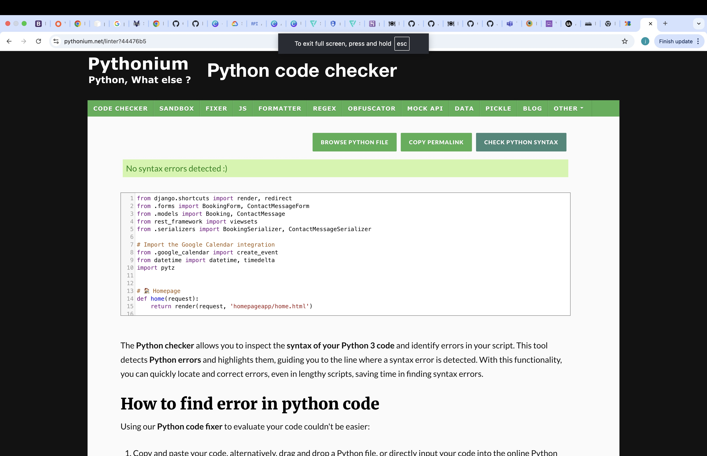
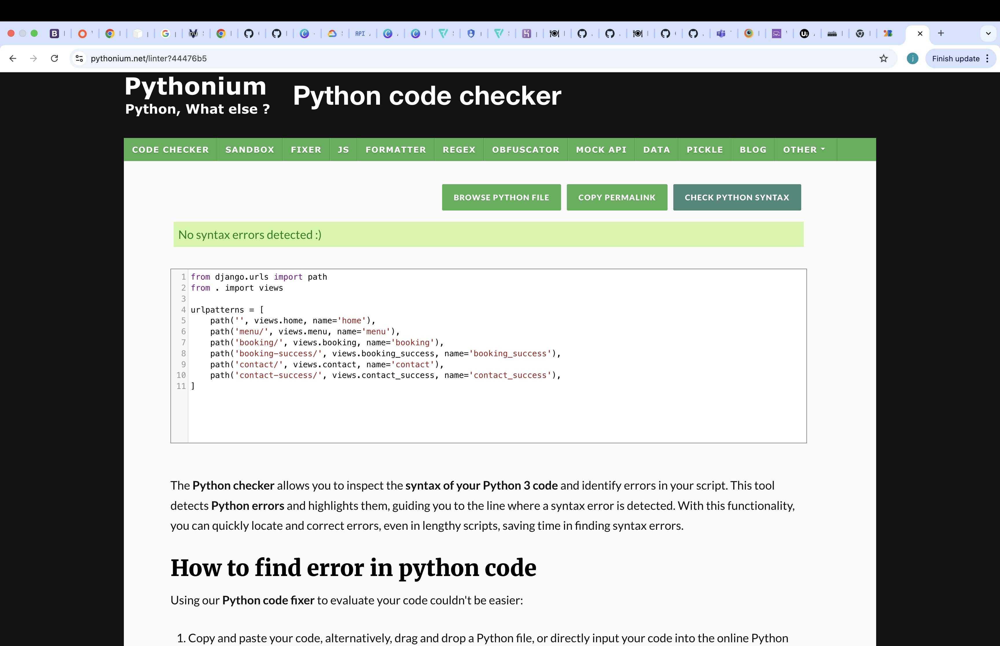
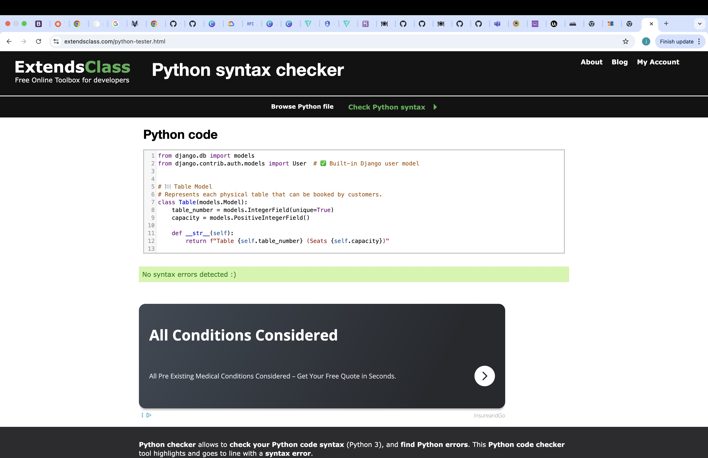
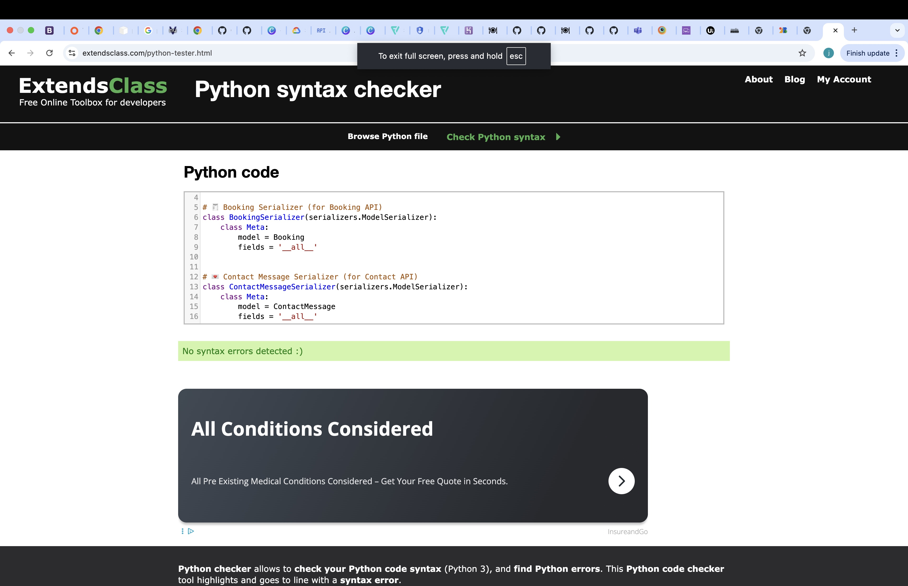
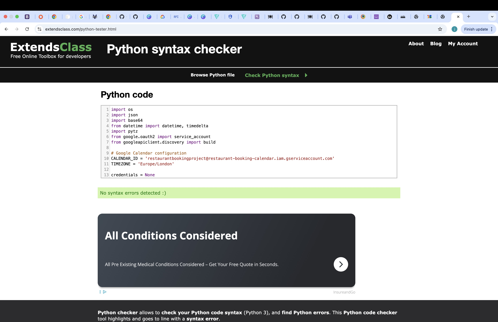
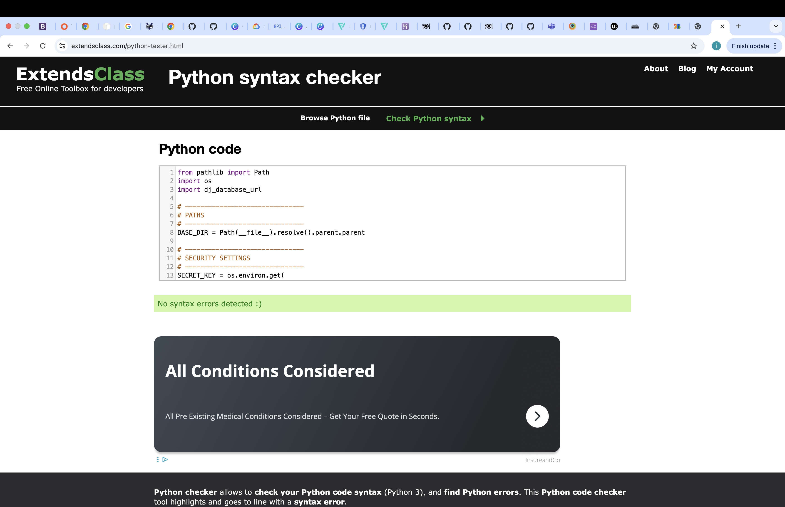
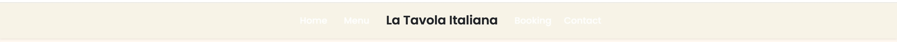
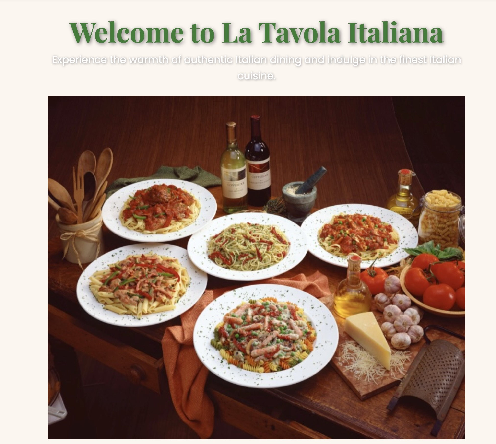
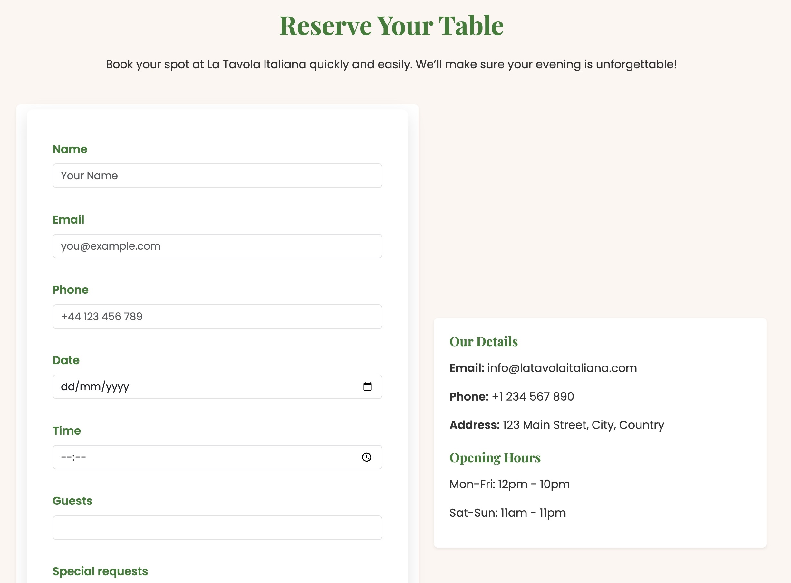

# 🍽️ La Tavola Italiana : Project 3
---
## 📖 Project Overview

The Restaurant Booking System Project is a full-stack web application built using HTML, CSS, JavaScript, Python, and Django, designed to provide users with a smooth and responsive experience when reserving a table at a restaurant.

The website allows visitors to browse the restaurant’s menu, make online bookings, and send contact messages — all within a clean and mobile-friendly interface.

The project demonstrates the integration of a relational database, with PostgreSQL handling data for bookings, contact messages, and tables.

Users can submit reservation details via a secure online form, which is processed and stored in the database for the site owner to manage.

This application was developed as part of my Code Institute Level 5 Diploma in Web Application Development, showcasing skills in full-stack development, database management, and deployment using Heroku.

The system aligns with the course’s mandatory project criteria by providing complete CRUD functionality, structured front-end design, and integration with external APIs (Google Calendar).

The site aims to simplify restaurant reservations by offering a digital alternative to traditional booking methods, while maintaining an elegant and authentic Italian-inspired design theme throughout the interface.

[View the live project here.](https://project3rb-d3edfb5c8d9d.herokuapp.com/)

---
## 🗣️ User Experience (UX)

<u>User Stories</u>
  <u>First Time Visitor Goals</u>

- As a first-time visitor, I want to immediately understand what the website is about so I can see that it’s for restaurant table bookings.

- As a first-time visitor, I want to browse the menu section to explore what types of dishes and drinks the restaurant offers.

- As a first-time visitor, I want to easily find the booking form to reserve a table without needing to call or email.

- As a first-time visitor, I want to feel confident that my booking details will be securely stored and confirmed.

- As a first-time visitor, I want to send a message or enquiry to the restaurant for special occasions or dietary requests.

- As a first-time visitor, I want the website to load quickly and display correctly on my mobile, tablet, or desktop device.

<u>Returning Visitor Goals</u>

- As a returning visitor, I want to make another booking without having to learn the system again it should feel familiar and simple.

- As a returning visitor, I want to check if the restaurant has added new menu items, specials, or seasonal dishes.

- As a returning visitor, I want to modify or cancel a booking easily if my plans change.

- As a returning visitor, I want to contact the restaurant again with follow-up questions or feedback via the contact form.

- As a returning visitor, I expect consistent branding and performance so that I trust the restaurant’s online service.

<u>Frequent User Goals</u>

- As a frequent user, I want to quickly view available dates and times for booking my favourite table.

- As a frequent user, I want to check for promotions, events, or loyalty offers that might encourage me to visit again.

- As a frequent user, I want to see menu updates or new dishes since my last visit.

- As a frequent user, I want to know that my previous booking and contact history are stored securely and handled professionally.

- As a frequent user, I expect the website to stay fast, modern, and responsive each time I visit, with a consistent design and reliable functionality.
---

###<u>Design</u>

<u>Colour Scheme</u>

The restaurant website uses a warm and authentic Italian-inspired color palette, designed to reflect a welcoming, high-quality dining atmosphere. The combination of colors is elegant yet comforting — echoing the tones of Italian interiors and cuisine.

 ### Colour - Hex Code - Purpose

- Ivory	#fff8f0	Used as the main background color to create warmth and readability

- Deep Green	#2e7d32	Used for headings and highlights to symbolize freshness and nature

- Italian Red	#c62828	Used for buttons and key accents to represent passion and Italian heritage

- Dark Charcoal	#333	Used for standard text for easy readability

- Soft Cream	#fdf6f0	Used in hero and content sections for a subtle & luxurious tone.

These colors work together to create a consistent brand identity that is both modern and inspired by traditional Italian design sensibilities.

---
###<u>Typography</u>

Two fonts were chosen to complement the restaurant’s aesthetic and ensure readability across all devices:

Playfair Display – used for headings to add a classic, elegant feel (serif font inspired by traditional Italian signage).

Poppins – used for body text to maintain clean, modern readability with a friendly tone.

Both fonts are imported via Google Fonts and are supported by standard sans-serif fallbacks.

[Click here for Google Fonts Link](https://fonts.google.com/specimen/Playfair+Display)

This pairing creates a clear hierarchy between headings and body text while keeping the designs visually balanced.

---
###<u>Imagery</u>

Imagery plays a vital role in the restaurants visual experience:

- The hero section features Italian dining or cuisine photography that instantly communicates the atmosphere.

- The menu cards and about section images are styled with round edges and soft shadows to maintain consistency and profressionalism.

- All images were optimized for performance and responsiveness, ensuring fast load times on both desktop and mobile devices.

Overall the projects imagery focuses on food, culture and hospitality, all key emotional triggers for users looking to book at a restaurant.

---
###<u>Layout and Structure</u>

The layout follows a mobile-first responsive design, structured with Bootstrap’s grid system for consistency and scalability.
All sections — such as the hero, about, menu preview, booking form, and contact — adapt fluidly to various screen sizes, ensuring an optimal experience across devices from small smartphones to large monitors.

Key layout features:

- Responsive navigation bar and footer across all pages

- Centered hero content with overlay text for impact

- Grid-based menu layout for clear food item presentation

- Well-structured forms with spacing, validation, and responsive input fields

- Balanced use of white space and color accents to keep the site visually calm and readable

---
###<u>Accessibility</u>

Accessibility best practices were implemented throughout the design.

- All interactive elements (buttons, links, forms) have clear focus states and accessible labels.

- High color contrast between text and backgrounds ensures legibility.

- Semantic HTML tags are used for headings, sections, and navigation elements to improve screen reader compatibility.

- Forms include placeholder text and ARIA labels for usability.
---

## ✨ Features

###<u>Homepage</u>

A welcoming hero section introduces visitors to the restaurant with a clear call-to-action button for making a booking.
Includes a short introductory paragraph about the restaurant’s theme, atmosphere, and dining experience.
The design uses a subtle overlay and animation to create a visually engaging first impression.
Fully responsive layout ensuring an elegant appearance on all screen sizes.

<u>Menu Page</u>

Displays a selection of dishes grouped by category — starters, mains, desserts, and drinks.
Each menu item is shown using Bootstrap cards with smooth hover effects and shadows for a professional finish.
The layout automatically adapts for mobile and tablet devices, showing fewer items per row on smaller screens.
Easy to update dynamically through the Django database or admin panel if new dishes are added.

<u>Booking System</u>

- A fully functional table booking form allows users to select:
Their name, email, phone, date, time, and number of guests.

- Optional special requests for dietary needs or occasions.

- Bookings are stored securely in the database using Django’s ORM.

- A success page confirms that the booking was completed.

- Google Calendar API integration automatically creates an event for each booking, syncing it with the restaurant’s schedule.

- Built-in form validation ensures that no invalid or incomplete bookings can be submitted.

<u>Contact Page</u>

A user-friendly contact form where visitors can send messages or enquiries directly to the restaurant.
Messages are saved in the database and can be viewed in the Django Admin panel.
Confirmation feedback is displayed upon successful submission.
Uses Django’s built-in form validation to ensure correct email formatting and message input.

<u>REST API Endpoints</u>

Two main API endpoints are available via Django REST Framework:

- /api/bookings/ — Displays all booking records (GET), allows creation of new bookings (POST), and editing or deletion (PUT/DELETE).

- /api/contactmessages/ — Displays, creates, edits, or deletes messages submitted through the contact form.

- These APIs support CRUD functionality and are useful for integrating with external systems or mobile applications in the future.

<u>Admin Dashboard</u>

Django’s built-in admin interface provides a simple way to manage:

- Menu items
- Bookings
- Contact messages
- Users and permissions
- Admins can manually add, edit, or delete records, ensuring full control over the site’s data.

<u>Responsiveness</u>

- The entire website is built with a mobile-first approach using Bootstrap 5 and custom CSS media queries.

- Tested across multiple screen sizes and devices to ensure a consistent user experience.

- Elements like navigation, forms, and grids automatically adjust for small, medium, and large viewports.

<u>Security Features</u>

- CSRF protection for all form submissions.

- Secure handling of secret keys and Google API credentials using Heroku environment variables.

- HTTPS enforced via Heroku’s SSL.

- No sensitive credentials are stored in the project repository.

<u>Database</u>

- The project uses PostgreSQL for production (via Heroku) and local PostgreSQL for development.

- The database stores all bookings, contact messages, menu items, and user data.

- Relationships between models (Users, Tables, Bookings, Messages) are well-structured and normalized.

<u>Deployment</u>

- The project is deployed on Heroku with static files served using Whitenoise.

- A custom domain or subdomain can be easily linked.

- Environment variables like DATABASE_URL, DEBUG, and GOOGLE_CREDS are securely managed via Heroku’s config vars.

<u>Navigation & Layout</u>

- A Bootstrap navbar ensures users can easily navigate between pages.

- The navbar automatically collapses into a mobile-friendly toggle menu on smaller devices.

- A consistent footer section provides contact links, social icons, and copyright information.

<u>Future Enhancements</u>

- User authentication for registered customers (login/signup).

- Automatic email confirmations when a booking is created.

- Booking management dashboard for users to view and cancel their reservations.

- Integration of table availability logic to prevent double bookings.

- Additional visual enhancements such as image galleries and reviews section.
---
###<u>🧰 Technologies Used</u>

<u>Languages Used</u>

- HTML5 – for page structure and semantic markup.

- CSS3 – for styling, layout, and responsive design.

- JavaScript (ES6) – for interactive features and Bootstrap’s built-in functionality.

- Python 3 – for server-side logic, database management, and API handling within Django.

###<u>Frameworks, Libraries & Tools</u>

<u>Django 4.2</u>

- The main Python web framework used to build the project.

- Manages URLs, views, models, forms, authentication, and database operations.

- Used for creating REST APIs through the Django REST Framework.

<u>Django REST Framework (DRF)</u>

- Handles the creation of API endpoints for bookings and contact messages.

- Enables full CRUD functionality (Create, Read, Update, Delete).

- Provides robust serialization and validation for API data.

<u>Bootstrap 5</u>

- Used extensively for responsiveness and layout structure.

- Ensures the website adapts perfectly to various screen sizes.

- Provides components such as modals, buttons, navbars, and carousels.

<u>PostgreSQL</u> 

- The relational database used for production on Heroku.

- Stores all booking, contact, and user data.

- Ensures data integrity and scalability for real-world usage.

<u>Google Calendar API</u>

Connects the website’s booking form with a Google Calendar.

Automatically creates an event when a new booking is made.

Uses secure credentials stored in Heroku environment variables.

<u>Whitenoise</u>

- Simplifies static file handling in production.

- Compresses and serves CSS, JS, and image files efficiently.

<u>Gunicorn</u>

- Python WSGI HTTP server used to deploy Django applications on Heroku.

<u>dj-database-url</u>

Allows Django to connect easily to Heroku’s PostgreSQL database via an environment variable.

<u>Widget Tweaks</u>

- Used to customize form styling within Django templates without modifying form classes.

<u>Git</u>

- Used for version control to commit changes and track project development.

<u>GitHub</u>

- Stores the project’s repository and documentation.

<u>Heroku</u>

- Hosting platform for deploying the live Django web application.

- Handles server-side operations and database connections.

<u>Balsamiq Wireframes</u>

- Used during the planning phase to design basic page layouts and UX structure.

<u>Google Fonts</u>

- Imports the custom typography (Playfair Display & Poppins) used throughout the website.

<u>Font Awesome</u>
Provides iconography used in the footer, navbar, and buttons for better UI/UX.

###<u>Additional Tools</u>

VS Code – Primary code editor for development.

Chrome DevTools – Used for live responsiveness and debugging.

W3C HTML & CSS Validators – Ensured syntax and structure validation.

GitHub Projects – For project organization and tracking milestones.

## 🧪 Testing

The W3C Markup Validator and W3C CSS Validator, JS Validator plus Python code checker were all different services that were used to validate every page of the project to ensure there were no syntax errors in the project.
Lighthouse on chrome was also used to check the websites integrity during the testing process.

<U>HTML5 Results</u>

No errors shown from HTML Checker.

No errors shown from CSS Checker.

One error found through JS checker was wrong, it stated the first two lines of a file was incorrect this was !DOCTYPE html & html lang="en" both integral parts of a websites integrity.

Views.py - 

urls.py - 

models.py - 

serializers.py - 

google_calendar.py - 

settings.py - 

###<u>Testing User Stories From User Experience (UX) Section</u>

<u>First Time Visitor Goals</u>

**Goal**: To understand what the website is about and how to use it easily.

- When users visit the homepage they are greeted with a clean hero section that introduces the restaurant and its atmosphere.

- A clear **navigation bar** at the top that allows easy access to the Home, Menu, Booking and contact pages.

- The overall design, imagery, and colors communicate the restaurant’s brand and style clearly.

- The layout is fully responsive, ensuring a seamless experience across desktop, tablet, and mobile devices.

- On the Booking page, the form is intuitive, with clear labels and placeholders that help users complete it easily.

- The Contact page provides a straightforward way for users to reach out with questions or feedback.

<u>Returning Visitor Goals</u>

**Goal**: To quickly make another booking or contact the restaurant again.

- Returning users can instantly locate the Booking and Contact pages via the main navigation bar, which stays fixed and visible on all pages.

- The site’s layout and structure remain consistent, ensuring returning users can easily find what they need without relearning the interface.

- The menu page allows visitors to review dishes and decide on what to order before making a new booking.

- Forms include validation messages so users receive instant feedback on any errors (e.g., missing fields or invalid inputs).

- Responsiveness allows returning visitors on mobile devices to complete bookings just as easily as on desktop.

---

<u>Frequent User Goals</u>

**Goal**: To make regurlar bookings and stay connected with the restaurant.

- Frequent visitors can revisit the site anytime to make new bookings using the same simple and responsive form.

- They can view the menu to check for updates or new additions before dining again.

- The Contact page remains available for loyal customers to share feedback, make special requests, or inquire about events.

- The booking and contact forms work consistently across devices, meaning frequent users can use the site whether they’re at home or on the go.

- Confirmation messages reinforce trust, showing that each new booking or message has been received successfully.

---

### 📲 Further Testing

Extensive testing was carried out throughout the development and deployment of the project to ensure that all features and functionality worked correctly and consistently across different devices and browsers.

- The website was manually tested on multiple devices, including:
iPhone SE, iPhone 13, iPad, MacBook Pro, and 24” Monitor
Android devices such as Samsung Galaxy S22
The project was tested using browser developer tools in Google Chrome, Firefox, Microsoft Edge, and Safari.

- Each page — Home, Menu, Booking, and Contact — was checked for proper alignment, spacing, and responsiveness at various screen sizes.

- The Bootstrap grid system and custom media queries were verified to ensure that layout elements such as cards, buttons, and hero sections scale correctly.

- The site was also tested using online responsiveness testing tools (such as Am I Responsive and Responsinator) to confirm that content displays properly across mobile, tablet, and desktop viewports.

<u>Browser Compatibility</u>

The project was tested on the following browsers:

- Google Chrome (latest version)

- Mozilla Firefox

- Safari (macOS)

- Microsoft Edge

- Functionality, styling, and responsiveness were consistent across all browsers.

- Minor spacing and text alignment adjustments were made to ensure pixel-perfect consistency between Chrome and Safari.

<u>Form Testing</u>

Both the Booking and Contact forms were tested extensively to ensure correct functionality and validation.

**Form Validation:**

- Required fields correctly prevent submission when left empty.

- Email and date fields only accept valid inputs (e.g., proper email format, future dates).

- Validation messages display correctly when users attempt to submit incomplete forms.

**Booking Form:**

- Submitting the form successfully adds a new booking record to the PostgreSQL database.

- A confirmation success page appears after each valid submission.

- Bookings automatically send data to the linked Google Calendar API (if enabled).

**Contact Form:**

- Successfully saves user messages into the database.

- Displays a confirmation redirect after successful submission.

<u>API & Database Testing</u>

- API endpoints for Booking and ContactMessage were tested via Django’s REST Framework.

- Each endpoint (/api/bookings/ and /api/messages/) returns accurate JSON data.

- CRUD operations (Create, Read, Update, Delete) were confirmed to work correctly through the Django admin panel and API browser interface.

- PostgreSQL database integration on Heroku was confirmed to store and retrieve all records successfully.

- The Google Calendar API was tested using valid service credentials; event creation was confirmed via the Google Calendar dashboard.

## 🐛 Known Bugs 

- API Configuration on Heroku:

The Google Calendar API required reconfiguration after deployment to Heroku due to environment variable formatting issues. Although the credentials were correctly set locally, Heroku sometimes misinterpreted JSON strings within environment variables. 

The issue was resolved by reformatting the GOOGLE_CREDS value and redeploying the app.

- Responsiveness Testing Tools:

Some third-party responsiveness checkers (e.g., Am I Responsive) were unable to display the live Heroku app due to Django’s X_FRAME_OPTIONS security policy. This did not affect normal site usage — the site remains fully responsive and accessible on all device types.

- Minor Spacing and Alignment Adjustments:
During testing, small layout inconsistencies appeared between Safari and Chrome. These were resolved with custom CSS media queries.

### 👏🏾 Credits

- The [Bootstrap 5 Navbar Docs](https://getbootstrap.com/docs/5.3/components/navbar/) was used for the projects menu automation around the site.

- [Django Docs](https://docs.djangoproject.com/en/4.2/) was used to install and configure Django files to the project correctly.

- The hero overlay and fade-in animation were inspired by [CSS-Tricks](https://css-tricks.com/) tutorials on layered background effects and keyframe animations.

- Both the booking and contact form were based on the Bootstraps 5 [Form Layout Examples](https://getbootstrap.com/docs/5.0/forms/layout/), with Django handling the back-end validation and saving to the database.

- Django REST Framework (API Setup) was installed and applied to the project through the [Django Rest Tutorial](),
The **ModelSerializer** and **APIView** components were adapted and extended to fit the restaurant booking systems database stucture.

- [The Google Calendar](https://developers.google.com/workspace/calendar/api/quickstart/python) was integrated into the project from the google calendar api for developer docs.

- The projects Heroku setup and PostgreSQL integration were based on Code institutes "I think Therefore I Blog Walkthrough" and Heroku Documentation.

The **dj_database_url** and **whitenoise** packages were configured for static file handling and database connections.

- The responsive grid and hover animations were based on various examples from [BootstrapMade templates](https://bootstrapmade.com/)

- The footer design was inspired from a online [Bootstrap Footer Template Doc](https://mdbootstrap.com/docs/standard/navigation/footer/examples-and-customization/) and modified to align with the project.

- [MDN Web Docs](https://developer.mozilla.org/en-US/) was used for input validation, JS & CSS. 

- [Code Insitute LMS](https://learn.codeinstitute.net/courses/course-v1:CodeInstitute+FSD101N+6/courseware/713441aba05441dfb3a7cf04f3268b3f/0758f42698bf498382b68a9cb8e72483/) was used for Django form handling, database setup and deployment structure examples.

- [W3Schools](https://www.w3schools.com/) was used for syntax references and front-end design examples.

- [Playfair Display](https://fonts.google.com/specimen/Playfair+Display) and [Poppins](https://fonts.google.com/specimen/Poppins) are both google fonts applied to the project.

- [Pexels](https://www.pexels.com/) and [Unsplash](https://unsplash.com/) were used to source images for the background and menu for the project.

**The Project was developed by Jermaine McKenna.**

### ✈️ Deployment 

This project was deployed using Heroku with a PostgreSQL database.

**Local Development Setup**

1. Clone the Repository.
- Navigate to the GitHub repository for the project.
- Click the green **Code** button and copy the HTTPS link.
- Open terminal or VS Code and run:
git clone https://github.com/jermainemckenna/project3rb.git
- Navigate into the project folder: cd project3rb
2. Create and Activate a Virtual Enviroment
- Run the following commands to create a virtual enviroment:
- python3 -m venv venv
- source venv/bin/activate
3. Install the Project Dependencies
- pip install -r requirments.txt
4. Create a .env File
- Inside the project directory, create a .env file
- Add the following enviroment variables: 
SECRET_KEY
DEBUG=True
DATABASE_URL
GOOGLE_CREDS
5. Apply Migrations and Create a Superuser:
- python3 manage.py makemigrations
- python3 manage.py migrate
- python3 manage.py createsuperuser
6. Run the Local Server:
- python3 manage.py runserver

**Deployment to Heroku**

1. Create a Heroku App

- Log in to your [Heroku Dashboard](https://dashboard.heroku.com/apps)

- Click New → Create new app.

- Enter an app name and select your region.

2. Set up PostgreSQL Database:

- In your Heroku app dashboard, go to Resources → Add-ons.

- Search for Heroku Postgres and add it to your project (free tier).

3. Attach Environment Variables:

**In Settings → Reveal Config Vars, add the following keys:**

- SECRET_KEY = your_django_secret_key

- DEBUG = False

- DATABASE_URL = (already added automatically by Heroku Postgres)

- GOOGLE_CREDS = your_google_calendar_credentials_json

- Ensure your JSON credentials for GOOGLE_CREDS are minified (no line breaks).

4. Update settings.py for Production

**Key changes made:**

- Added 'whitenoise.middleware.WhiteNoiseMiddleware' to handle static files.

- Configured PostgreSQL using dj_database_url.

- Set STATIC_ROOT, STATICFILES_STORAGE, and updated ALLOWED_HOSTS.

5. Create Procfile

- In the root directory, create a file called Procfile (no extension) containing:

- web: gunicorn project3rb.wsgi

6. Freeze Dependencies

**Run the following command to generate your requirements file:**

- pip freeze > requirements.txt

7. Commit All Changes to Git

- git add .

- git commit -m "Prepare project for Heroku deployment"

- git push

8. Push to Heroku

**Link your project to Heroku using the Heroku CLI:**

- heroku login

- heroku git:remote -a project3rb

- git push heroku main
If your main branch is called master, replace main with master.

9. Run Migrations on Heroku

- heroku run python3 manage.py migrate

- heroku run python3 manage.py createsuperuser
Collect Static Files
heroku run python3 manage.py collectstatic --noinpu

10. Open Deployed App:

- heroku open

